[TOC]


#  CoreJava_Note

## 特点


1.简单性：相对c++语言简单
2.跨平台：平台就是操作系统，linux,macos,unix,windows
3.面向对象:使用计算机模拟现实世界，解决现实问题，更贴近人的思维方式


## 执行机制


1.编译执行：源文件编译成机器码，一次编译，多次执行，执行效率高，不可跨平台
2.解释执行：源文件一行一行解释，一行一行执行，不同的操作系统具备不同的解释器 执行效率低 可以跨平台
3.java先编译再解释执行  源文件编译生成字节码文件（平台中立文件  .class）,再将字节码文件进行解释执行

##  JVM,JRE,JDK


1.JVM(Java Virtual Machne)虚拟机：使用软件在不同的操作系统中，模拟出相同的环境
2.JRE（Java ERuntime Environment）运行时环境：包含JVM和解释器，核心类库 完整的Java运行环境
3.JDK(Java Development Kit)java开发环境：包含 JRE+开发工具包（编译器+调试工具）
其中的开发工具：编译工具(javac.exe)  打包工具(jar.exe)等


## 三个体系

　JavaSE(JSE)(Java2PlatformStandardEdition，java平台标准版）

　JavaEE(JEE)(Java2Platform,EnterpriseEdition，java平台企业版)

　JavaME(JME)(Java2PlatformMicroEdition，java平台微型版)

　　
## 环境搭建


JAVA_HOME：==变量值JDK的安装目录==
Path：变量值：jdk  bin目录的路径
classpath：指定虚拟机去指定目录加载 .class文件  默认.
    
    
补充：
临时配置方式：通过dos命令中set命令完成
set ：用于查看本机的所有环境变量的信息。
set  变量名 ：查看具体一个环境变量的值。
set  变量名=：清空一个环境变量的值。
set  变量名=具体值 ：给指定变量定义具体值。

想要在原有环境变量值基础上添加新值呢？
首先，通过%变量名%操作符获取到原有环境变量的值。
然后加上新值后再定义给该变量名即可
举例：给path环境变量加入新值
		set  path=新值;%path%
注：这种配置方式只在当前dos窗口有效。窗口关闭，配置消失。


## 黑窗口指令


cd 文件夹名  切换到指定文件夹      
cd..        切换到上一层            
cd\         直接到当前盘的根目录    
dir         查看当前目录下的文件信息      
cls         清空当前窗口的命令         
盘符：  切换盘符
md :      创建目录
rd :        删除目录
del:        删除文件
exit：    退出dos命令行
直接打开程序  ：命令 在程序的目录下 输入要打开的程序名  
注意 ： 当改变完环境变量之后 需要重新打开新的cmd窗口才会生效

编译指令：javac  源文件名.java
执行指令：java   类名


## 总结


1.源文件中可以书写多个类，书写时是并列关系,且源文件后缀为  .java           编译之后，会分别编译成字节码文件
2.每个类中只可以有一个主函数，主函数是程序的入口
3.源文件中有且只有一个公开类（public class），且公开类的类名必须和源文件名保持一致。


## package包


类似于文件夹 对.class文件进行管理 解决.class文件重名的问题

编译：javac -d . 源文件名.java
解释执行java 包名.类名


## 标识符命名规则


java 标识符命名规则

Java 对各种变量、方法和类等要素命名时使用的字符序列称为标识符，凡是自己可以起名字的地方都叫标识符。


Java标识符的命名规则：
应以字母、下划线、美元符开头后跟字母、下划线、美元符$或数字
Java标识符大小写敏感，长度无限制

1.标识符可以由字母、数字、下划线_、美元符（$）组成，但不能包含 @、%、空格等其它特殊字符，不能以数字开头。 
2.类名，接口名是以大写字母开头的名词。如果名字由多个单词组成，每个单词的第一个字母都应该大写
3.方法名，变量名，函数名一般首个字母小写（构造方法例外），多个单词组成方法名，后面单词首字母大写
4.包名：全部小写，用小数点隔开
5.常量：全部大写，单词间用下划线_隔开
6.标识符不能是 Java 关键字和保留字（ Java 预留的关键字，以后的升级版本中有可能作为关键字），但可以包含关键字和保留字。如：不可以使用 void 作为标识符，但是 Myvoid 可以
7.标识符的命名最好能反映出其作用，做到见名知意。

Java 语言中有一些具有特殊用途的词被称为关键字。


Java保留字：现有Java版本尚未使用，但以后版本可能会作为关键字使用。自己命名标记符时要避免使用这些保留字 byValue、cast、future、 generic、 inner、 operator、 outer、 rest、 var 、 goto 、const


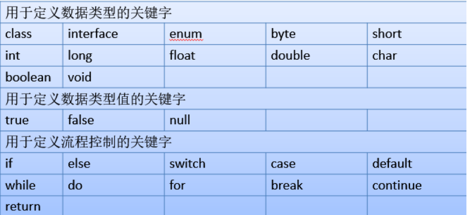

## 代码注释


// 单行注释
/* 多行注释*/


/**
	文档注释 javadoc  -d . 源文件名.java
	
文档注释操作方式:
``` java 
javadoc -d  mydoc -author -version HelloWorld.java
```
	
	格式：
	   	*@author  指定java程序的作者
	 	*@version  指定源文件的版本
	    *@param   方法的参数说明信息
	            

*/

注意：对于单行和多行注释，被注释的文字，不会被JVM（java虚拟机）解释执行。
多行注释里面不允许有多行注释嵌套。


## 变量

### 什么是变量


概念：变量内存中一块空间，是数据存储的基本单元，数据的容器
硬盘（外存）：存储的数据是永久的
内存条（内存）：程序运行时加载的一些教程，教程是临时的

java是强类型的编程语言

变量的概念：
内存中的一个存储区域
该区域有自己的名称（变量名）和类型（数据类型）
Java中每个变量必须先声明，后使用
该区域的数据可以在同一类型范围内不断变化
使用变量注意：
变量的作用域：一对{ }之间有效	
初始化值
定义变量的格式：数据类型    变量名  =  初始化值
变量是通过使用变量名来访问这块区域的


### 变量的组成要素


三要素

变量名
变量里存放得数据类型
变量值

### 定义变量


分两步
变量的声明
		语法：数据类型  变量名
变量的赋值
		语法：变量名 = 变量值


### 变量的使用


可以通过打印语句去打印出变量的值
语法：System.out.print(变量名)；
>注意 ： 打印变量值的时候千万不要加双引号！！！！！！！

### 定义变量的方式


1.先声明 再赋值
2.声明的同时并赋值
3.同时声明多个相同类型的变量 在声明的同时可以不赋值或者部分赋值或者全部赋值
>注意：声明多个变量时，变量之间用逗号隔开
注意：变量未赋值不能使用


## 数据类型

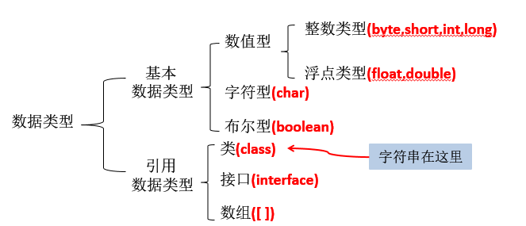
### 基本数据类型

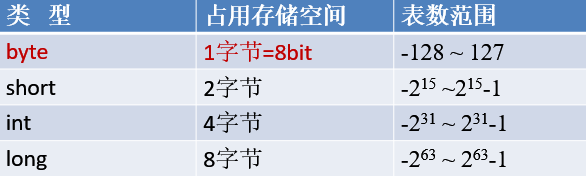
#### 整数类型（4种）
|类型|字节|位|表数范围|
|---|---|---|---|
|byte|    1 |   8     |         -128~127|
|short |  2   |16     |       -32768~32767|
|int     |4   |32      | -2147483648~2147483647|
|long   | 8   |64  |               -2^63 - 2^63-1，即-9223372036854775808~223372036854775807|

1字节(Byte)=8位（bit）
一个bit中只能存放0或者1

字面值：能够给变量赋的值  字面值默认类型是int   ；long类型的变量在赋值的时候需在变量值后加L/l（建议大写）

 long l = 2147483648L;


#### 小数类型（浮点类型）

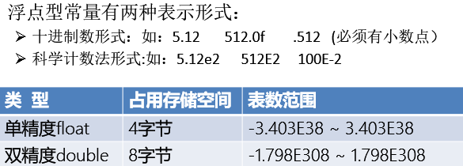

>注意：在小数类型变量的字面值 默认类型是double
注意：float类型的变量定义时需要在变量值后加F/f
double 类型的变量定义时 变量值后可加可不加
float f = 2.1F;


>面试题：float和int都占4个字节  那么谁存储的数据范围大？
答：float采用科学计数法  所表示的范围远远大于int类型所表示的数据范围


#### 字符类型


                
char        2字节             0——65535

字符类型的变量定义方式：
字符常量是用单引号（''）括起来的单个字符，涵盖世界上所有书面语的字符

Java中还允许使用转义字符‘\’来将其后的字符转变为特殊字符型常量。例如：char c3 = '\n';  // '\n'表示换行符

1.直接用单引号赋值
				char c = 'A';
2.用数值进行赋值
				char c = 65;
		A:65     a:97    之间相差32
3.unicode编码
				char c = '\u0041';

char 类型是可以进行运算的，因为它都对应有Unicode码

#### 转义字符


>\n  换行符
\t  制表符 tab键
\\  反斜杠
\\'  单引号
\\"  双引号
\r  回车键
\b  退格键


#### 布尔类型（boolean）


boolean :
		值得形式：true(真)  false(假)
 

### 引用数据类型


String(字符串类型) 用双引号引起来
语法：数据类型 变量名 = 字符串；

值null可以赋值给任何引用类型（类、接口、数组）的变量，用以表示这个引用类型变量中保存的地址为空

String类是一个典型的不可变类，String对象创建出来就不可能被改变。创建出的字符串将存放在数据区，保证每个字符串常量只有一个，不会产生多个副本。


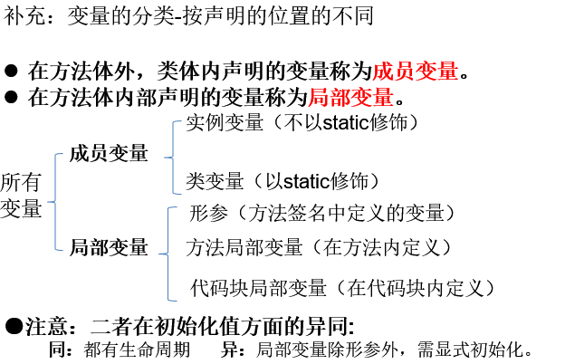
### 数据类型之间的转换

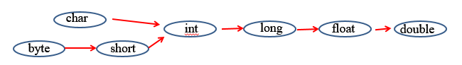


自动类型提升
		条件：
		1.数据类型相互兼容且目标类型大于源类型
		2.小范围的数据复制给大范围的
		两条线：
		byte--->short--->int--->long--->float--->double
		char--->int--->long--->float--->double
		


----------


强制类型转换
		条件：
				1.数据类型不能相互兼容，且目标类型于源类型
				2.大范围的数据 赋值给小范围的数据
				语法;
				原数据类型 变量名1 = 变量值
				目标数据类型 变量名2 = （目标数据类型）变量名1；
> 注意：小数类型强制转换成整数类型 直接将小数点部分舍去
总结：强制类型转换可能会损失精度.通常，字符串不能直接转换为基本类型，但通过基本类型对应的包装类则可以实现把字符串转换成基本类型。
如： `String a = “43”; int i = Integer.parseInt(a);`
boolean类型不可以转换为其它的数据类型。  


				
>有多种类型的数据混合运算时，系统首先自动将所有数据转换成容量最大的那种数据类型，然后再进行计算。      
byte,short,char之间不会相互转换，他们三者在计算时首先转换为int类型。
当把任何基本类型的值和字符串值进行连接运算时(+)，基本类型的值将自动转化为字符串类型。 


### 表达式


概念：由 变量 和 运算符 以及 字面值 组成的一个式子，每个表达式都有一个值

在表达式计算中也存在数据类型转换

规则：
	1.有一个是double,结果提升为double
	3.有一个为float，结果提升为float
	4.有一个为long，结果提升为long
	4.其余情况都为int		


### 原码，反码，补码


正数的原码、反码、补码都相同


----------


负数的补码是其反码加1。
原码：直接将一个数值换成二进制数。
反码：是对原码按位取反，只是最高位（符号位）确定为1。


## 运算符

### 算术运算符


> 算术运算符
+
-
*
/
%
注意：字符串连接符 +
当字符串和其他的变量或者字面值用+连接时，字符串左右的值都会以字符串的形式和这个字符串连接
如果对负数取模，可以把模数负号忽略不记，如：5%-2=1。 但被模数是负数则不可忽略。此外，取模运算的结果不一定总是整数。
对于除号“/”，它的整数除和小数除是有区别的：整数之间做除法时，只保留整数部分而舍弃小数部分。 

```java
//案例：
public class Test2{
	public static void main(String[] args){
		System.out.println("152班辉煌"+3+4);
		System.out.println(3+4+"152班辉煌");
	}
}
```

### 赋值运算符
    
>当“=”两侧数据类型不一致时，可以使用自动类型转换或使用强制类型转换原则进行处理,支持连续赋值。
+=
-=
*=
/=
%=

**当用赋值运算符的时候，不会进行类型提升**

public class Test1{
	public static void main(String[] args){
		byte b=5;
        //b=b+1;这是错误的
        //int c = b+1;//第一种解决方式
        //b = (byte)(b+1);//第二种解决方式
        b+=1；
        System.out.println(b);
	}
}
  

### 自增自减运算符


\++：--->  a+=1;
注意 ： a\++和\++a 都是对a进行加1操作，没有区别。
a\++ 和\++a 都是表达式，表达式的值是不同的
a\++是a没有加一的值------>a
\++a是a加一之后的值------>a+1
--:--->   a-=1; 后面同上


### 关系运算符（比较运算符）


>
>=
<
<=
!=										
==
^逻辑异或
用关系运算符的出的结果都是布尔类型的值 true false


### 逻辑运算符

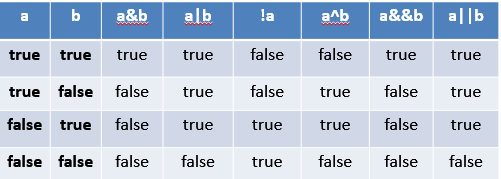
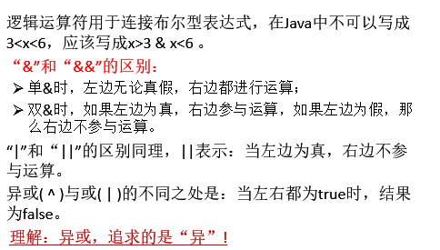

&   逻辑与： 当运算符两边的值都为true 那么这个表达式的值为true,反之为false
&&  短路与:
|   逻辑或: 当运算符两边的值都为false 那么这个表达式的值为flase，反之为true
||  短路或
！  逻辑非： ！true=false  !false=true
    
与和短路的区别
```java
public class Test2{
	public static void main(String[] args){
		int a = 6;
		int b = 4;
//                  	        false true
		System.out.println( (a<b)&(++a=7));//false
		 System.out.println(a);//7
//                    短路与 false直接短路 后边不执行
   		 System.out.println((a<b)&(++a=7));//false
   		 System.out.println(a);//6
	}
}
```

### 位运算符

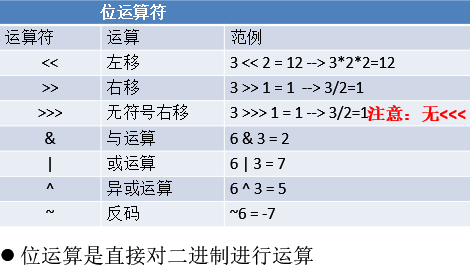
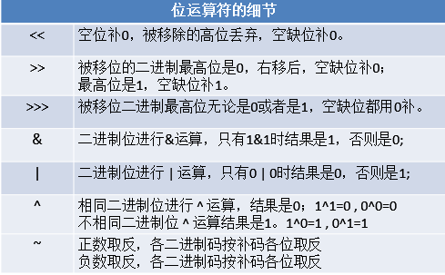
### 三元运算符

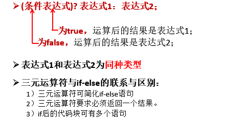


语法：
布尔表达式？值1：值2；

如果布尔表达式的值为true,则表达式的值取值1；否则取值2
案例：
```java 
public class Demo{
    //程序的入口 主函数
    public static void mian(String[] args){
    	int a = 4;
    	int b = 7;
    	int c = a>b?a:b;
    	System.out.println(c);
    	
    }
}
```

### 运算优先级


只有单目运算符、三元运算符、赋值运算符是从右向左运算的


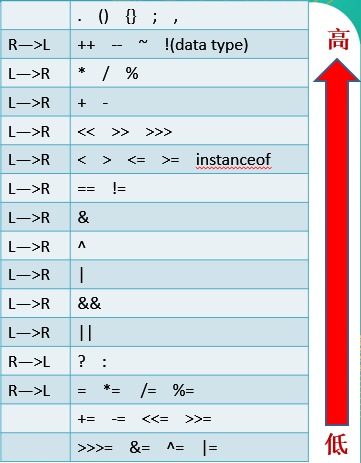


## 流程控制之分支结构

### Scanner类的引入


Scanner 扫描仪的意思

用于接收键盘输入数据的

java.util里有很多工具类，其中就包括Scanner类


案例：
```java 
package com.baizhi.day3;

public class Demo{
	public static void main(String[] args){
		//引入扫描仪
		java.util.Scanner s = new Scanner(System.in);

		//接受键盘输入的int类型的数据
		int a;
		System.out.println("请接收int类型的数据");
		a = s.nextInt();
		System.out.println("您输入的数据是:"+a);
	}
}
```
### **接收其他数据类型的方法**

nextByte();     返回字节整数       
nextShort();    返回短整数
nextInt();      返回整数
nextLong();     返回长整数
nextFloat();    返回单浮点小数
nextDouble();    返回双浮点小数
next()和nextLine() 接收字符串String
nextBoolean();   返回布尔值
next().charAt(0)；接收字符
  
案例：
```java 
package com.baizhi.day3;

public class Demo{
	public static void main(String[] args){
		//引入扫描仪
		java.util.Scanner s = new Scanner(System.in);

		//接受键盘输入的int类型的数据
		//int a= s.nextInt();//接收int类型的数据
		//double d = s.nextDouble();//接收double类型的数据
		//String str = s.next();
		String str1 = s.nextLine();
		//System.out.println("您输入的数据是:"+a);
		//System.out.println(d);
		System.out.println(str1);
	}
}

//接收字符
package com.baizhi,dayo3;
public class Demo{
	public static void main(String[] args){
		//引入扫描仪
		java.util.Scanner s = new Scanner(System.in);
        System.out.println("请输入字符");
        char c = s.next().charAt(0);
        System.out.println(c);
    }
}
```

### 包的导入


语法：import  包名1.包名2.类名；导入包下特定的类
`import java.util.*；`导入包下全部的类

注意：
1.import语句必须放在package语句之后
2.每个类都会默认导入 java.lang包 


## 流程控制

### 顺序结构

>自顶向下 逐条执行 中间没有任何差别判断和跳转


### 分支结构

#### if 语句结构


>1.基础的if语句[重点]
if(条件表达式){   //  条件表达式<==>布尔表达式<==>布尔值
//代码块1    
}
后续代码2
....
先执行条件表达式的判断，如果结果为true,则执行代码块1，
如果结果为false,则不执行{}中的代码块，直接执行后续代码


>2.if‐else语句[重点]
if(条件表达式){
//代码块1 
}else{
//代码块2    
}
后续代码
.....
先执行条件表达式的判断，
如果结果为true,则执行代码块1，
然后跳出整个if‐else结构,去执行后续代码
如果结果为false,则执行代码块2，
然后跳出整个if‐else结构，去执行后续代码。


>3.多重if语句
if(条件表达式1){
//代码块1    
}else if(条件表达式2){
//代码块2    
}else if(条件表达式3){
//代码块3    
}else{
//代码块4    
}
后续代码
...
先进行条件表达式1的判断，若结果为true,则执行条件表达式1，然后跳出整个if结构，去执行后续代码，若结果为false,则执行条件表达式2的判断。                        
若条件表达式2的结果为true，则执行代码块2，然后跳出整个if结构，
去执行后续代码 ，若条件表达式2的结果为false，则进行条件表达式3的判断                 
若条件表达式3的结果为true,则执行代码块3，然后跳出整个if结构，去执行后续代码          
若条件表达式3的结果为false,则执行代码块4（else中的代码）,跳出整个if结构，去执行后续代码


>4.if的嵌套
if(条件表达式1){
//代码块1    
if(条件表达式2){    
//代码块2        
}else if(条件表达式3){    
//代码块3        
}    
}else{
//代码块4    
}
后续代码
...
执行流程：自己补充完成。
										


#### 注意的问题


>当if或者else语句块省略{}时 只执行if语句或者else语句后的第一句
建议写上{}


#### switch语句


多分支，用于等值比较
switch(表达式){
case 值1：代码块1;break;    
case 值2：代码块2;break;    
case 值3：代码块3;break;    
default:代码块4;break;    
}
后续代码
。。。

执行流程：         相等
           值1-------->语句1
           值2-------->语句2
           值3-------->语句3
  表达式的值--->值n
  
  
>总结：
 1.default语句一般放在最后一行，在其后可以加break也可不加； 如果放在第一行或者其他行，必须在其后加break语句;default子句是可任选的，当没有匹配的case时，执行default
 **2.表达式类型必须是byte  short int char jdk7.0之后支持string类型**
 **3.case 子句中的值必须是常量且不能重复**
 4.reak语句用来在执行完一个case分支后使程序跳出switch语句块；如果没有break.程序会顺序执行switch结尾


### 循环结构

#### 局部变量


概念：定义在函数内部的变量

特点：
	1.在定义变量的起始行到它所在的函数末尾，叫做局部变量的作用范围
	2.在作用范围重合内 不能定义同名局部变量
	3.变量未赋值不能使用


#### 循环的概念


1.概念：通过某个条件控制，重复且有规律的执行某段代码

2、重复的   有规律的   执行相同的代码
循环三要素：循环变量的初值   循环结束条件   递增量

3.起始位置开始跑  1  开始--- 循环变量的初始化
判断是否跑完十圈 ---------循环条件的判断
跑了一圈之后 心里默默的加1---循环变量的改变
结束的点   跑完十圈---结束循环

4.循环语句的四个组成部分
初始化部分（init_statement）
循环条件部分（test_exp） 
循环体部分（body_statement） 
迭代部分（alter_statement） 


#### 循环结构的种类（三种）

##### while 循环结构


>1.语法:
[初始化语句]
while(布尔表达式){//循环条件判断
    语句1；//循环体
    循环变量改变语句
}


执行流程：
1.循环变量的初始化语句
2.布尔表达式的值是否为true 如果为true  则执行语句1
3.表达式的值为  false时，跳出while结构，执行后续代码
特点：  先判断，后执行。
```java 
public class WhileLoop {
		        public static void main(String args[]){
        		int result = 0;
			int i=1;
			while(i<=100) {
			        result += i;
            	       	        i++;
			}
			        System.out.println("result=" + result);
		         }
		} 
```
>while循环的特点：
循环体执行0--n次


##### do...while循环结构


>[初始化语句]
		do｛
	        	语句或语句块;//循环体
		        [更改语句;//循环变量改变
		｝while(布尔值测试表达式); //循环条件判断


>特点： 先执行，后判断
循环体执行的次数 1---n次
```java 
public class WhileLoop {
		        public static void main(String args[]){
        		  int result = 0,  i=1;
			        do{
			        	   result += i;
           		       	   i++;
				 }while(i<=100);
			 System.out.println("result=" + result);
		       }
		} 

```

##### for循环结构


>for(循环变量初始化;循环条件的判断;循环变量的改变){
 循环体
}

>特点： 通常用于循环次数已知的情况
      循环变量初始化只执行一次
      循环体执行次数 0----n次


```java 
for(int i=1；i<100;i++){
    System.out.println(i);
}
```
关于 for循环各部分是否可以省略
1.循环变量初始化语句可以放到for循环外
2.循环变量改变语句可以放到for循环外
3.当循环条件判断省略或者写true的时候 默认都为true 导致死循环
4.for循环中小括号中三个部分可以同时省略 是for循环的死循环形式 但注意两个分号不能省略


##### 三种循结构的应用场景比较


1.明确知道循环次数的 优先选择for循环
2.当循环次数不明确 优先选择while循环
3.do while 循环 不常用


##### 流程控制语句break,continue,return


###### **1.break**
结束整个循环，跳出包含break语句的循环结构    

break语句出现在多层嵌套的语句块中时，可以通过标签指明要终止的是哪一层语句块 
	label1: 	{   ……        
	label2:	         {   ……
	label3:			{   ……
				           break label2;
				           ……
					}
			          }
			 } 


###### **2.continue**
结束本次循环，直接进入下次循环。

continue语句用于跳过某个循环语句块的一次执行 
continue语句出现在多层嵌套的循环语句体中时，可以通过标签指明要跳过的是哪一层循环 

###### **3.return**
并非专门用于结束循环的，它的功能是结束一个方法。当一个方法执行到一个return语句时，这个方法将被结束
与break和continue不同的是，return直接结束整个方法，不管这个return处于多少层循环之内


>说明
1.break只能用于switch语句和循环语句中。
2.continue 只能用于循环语句中。
3.二者功能类似，但continue是终止本次循环，break是终止本层循环。
4.break、continue之后不能有其他的语句，因为程序永远不会执行其后的语句。
5.标号语句必须紧接在循环的头部。标号语句不能用在非循环语句的前面。


##### 循环嵌套


概念：在一个循环里，循环体是另一个循环
比如：打印星星，九九乘法表


## 函数


存在的问题：冗余，重复性出现的功能性代码


1.函数概念：实现特定功能的一段代码，可以反复使用
2.函数的声明：定义了函数该具有的功能，需要的数据，和能够给函数使用者提供的数据
定义语法：
	public   static   返回值类型   函数名(形式参数1，形式参数2...){    					//函数的实现
//  功能代码;形式参数相当于在函数内部声明局部变量        
	}    
返回值类型：八种基本数据类型+引用类型+void    
   
3.定义的位置： 类的内部，其他函数的外部    与主函数是并列关系。


### 函数的调用


语法：
	无参函     : 函数名（）；
	一个参数函数：函数名（实际参数）； //  实际参数是具体的数值
	多个参数函数：函数名（实际参数1，实际参数2...）;


### 函数的参数


形式参数：说明函数需要一个什么类型的数据
实际参数：函数的调用者需要在调用函数时，真正传入的数据

注意：
	1.实际参数列表和形式参数列表的顺序 长度 类型 必须保持一致
	2.多个参数之间用 ， 隔开；


### 函数的返回值


概念：是传给函数调用者的结果
void------表示函数没有返回值
return----用于返回函数的返回值

>注意：
1.用于保存函数返回值的变量类型必须和函数返回值类型保持一致，或者比返回值类型大的类型
2.函数的返回值可以作为函数的实际参数
`eg: double a = add(add(10,20),40);//70`
3.当有返回值的函数在实现中存在分支结构，那么每个分支结构都必须有对应的返回语句  return语句
4.当return语句用在没有返回值的函数中，作用是立即结束函数的执行，在其后的语句不可达


### 小结


函数的作用：
	1.减少冗余代码，提高代码的重用性
	2.利于程序分工协作
重点：
	1.函数的定义 声明和实现
	2.函数的参数列表
	3.函数的返回值 return语句的注意事项
函数的三要素：
	1.返回值类型 
	2.函数名
	3.形式参数列表

### 函数的嵌套调用


概念：在一个函数的内部调用另一个函数
注意：不要使用两个函数相互调用，函数调用不要执行闭环


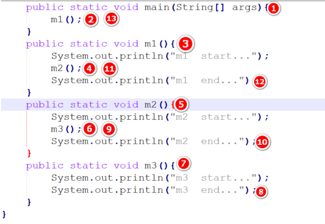

### 函数的递归调用


案例：计算4的阶乘
4！  4*3！
3！  3*2！
2！  2*1！
```java 
public class Demo{
	public  static void main(String[] args){
		System.out.println(jiecheng(34));
	}
    public static int jiecheng(int n){
    	if(n==1){
    		return 1;
   		 }else{
    		int sum = n*jiecheng(n-1);
    		return sum;
    	}
   }

}
```
递归的好处和不好的地方

1.在用递归解决问题，都可以用循环解决
2.在用递归的时候，会出现栈溢出异常stackoveflow
3.在使用递归的时候，注意递归的层数不能太多，递归一定设置递归出口，避免无限递归

练习：
利用递归计算 斐波那契数列 要求输入 n 输出n对应的数列中的数
n  1 2 3 4  5  6  7  8
数列：1 1 2 3  5  8  13  21  34 。。。。。。。
案例：
```java 
class MyClassdigui
{
	public static void main(String[] args) 
	{
		Scanner s=new Scanner(System.in);
		System.out.println("请输入一个整数");
		int a= s.nextInt();
		int b = digui(a);
		System.out.println(b);
	}

	public static void digui(int n){
		if(n==1||n==2){
			return 1;
		}else{
			return digui(n-1)+digui(n-2);
		}	
	}
}
```

## 数组

### 数组的定义[重点]

1.是一种数据类型，是引用类型，数组型数据是对象，数组中的每个元素相当于该对象的成员变量
2.是一块连续的内存空间，用于存储和管理相同类型的多个数据
3.数组中的元素可以是任何数据类型，包括基本数据类型和引用数据类型


### 一维数组声明


1.概念：数组是内存中的一块 连续的 内存空间，用于存放多个 相同类型的数据
2.数组的声明：定义了数组将要存放得数据类型
3.语法：
	type  var[] 或 type[]  var；
	数据类型 变量名[] 或 数据类型[] 变量名 
	
例如：
			int[] a; //建议这样写    
			int a[]; //C语言写法
			int []a
>注意：Java语言中声明数组时不能指定其长度(数组中元素的数)，如 int a[5]; //非法


### 动态初始化


**声明且为数组元素分配空间  与  赋值 的操作分开进行（动态初始化）** 

1.数据类型[] 变量名 = new 数据类型[长度];            
例如： int[] a = new int[5];//声明的同时并分配空间
       a[0] = 5;//赋值
       a[1] = 10;

2.变量名 = new 数据类型[长度];        
例如：  int[] a;            
       a = new int[5]; //先声明 后分配空间
       a[0] = 5;//赋值
       a[1] = 10;
	   
3.先声明 后赋值分配空间
int[] a;
a = new int[]{元素1，元素2，元素3.....}

### 静态初始化


**声明的同时 就 为数组分配空间并赋值（静态初始化）**

1.数据类型[] 变量名 = {value1,value2,value3};        
根据数据的个数，分配空间            
例如：  int[] a = {2,5,8,9}      //声明的同时并赋值，是下面2的简写形式

>注意：简写形式不能分开写成两行
//以下是错误的！！！！！！！！！！！！！
int[] a;
a={元素1，....};

2..明确开辟内存空间，根据数据个数来定        
数据类型[] 变量名 = new 数据类型[]{value1,value2,value3};        
例如：  int[] a = new int[]{1,2,5,4,7} //声明的同时并赋值


### 数组元素的默认初始化


数组是引用类型，它的元素相当于成员变量，因此数组一经分配空间，其中的每个元素也被按照成员变量同样的方式被隐士初始化。

例如：
```java 
public class Test{
public static void main(String[] args){
		int a[] = new int[5];
		System.out.println(a[3]);//a[3]的默认值为0
	}
}
```
对于基本数据类型而言，默认初始化值各有不同
对于引用类型而言，默认初始化为null,注意与0不同！


### 数组元素的默认值 


在数组元素开辟内存空间之后，不给元素指定值，系统会默认分配值。        
默认值取决于数组元素的类型  
整型[byte  short   int  long]                    0            
浮点型[double   float]                        0.0            
布尔类型[boolean]                    false            
字符类型[char]                      '\u0000' //对应空格           
引用类型[String  Object任意对象类型]   null     
    
>基本数据类型之间是值传递        
引用类型之间是地址传递     


### 数组扩容


概念 ：创建一个新的容量大的数组，将原数组的元素，复制到新数组中
方法：

```java 
public class Demo{
	public static void main(String[] args){
	int[] a = {1,3,5,7,9,11};//原数组
	//创建一个新的数组 长度是原数组的2倍
	int[] b = new int[a.length*2];
	//将原数组的元素赋值到新数组中
	for(int i = 0;i<a.length;i++){
		b[i] = a[i];
	}
	//将原数组的引用指向a\
		a = b;
		//遍历a数组
		for(int i = 0;i<a.length;i++){
			System.out.print(a[i]+"\t");
		}
	}
}
```


**2)System.arraycopy(原数组,原数组的小标，新数组，新数组的小标，长度)**

```java 
public class Demo{
	public static void main(String[] args){
	int[] a = {1,3,5,7,9,11};//原数组
	//创建一个新的数组 长度是原数组的2倍
	int[] b = new int[a.length*2];
	//将原数组的元素赋值到新数组
	
	/*第二种方法
	System.arraycopy(a,0,b,0,a.length);
*/
	//将原数组的引用指向a\
	a = b;
	//遍历a数组
	for(int i = 0;i<a.length;i++){
		System.out.print(a[i]+"\t");
		}
	}
}
```


**3)利用java.util包下的Arrays.copyOf(原数组，新数组的长度)，返回值的一个新的数组**
案例：
```java 
import java.util.*;
public class Demo{
	public static void main(String[] args){
		int[] a = {1,3,5,7,9,11};//原数组
		int[] b = Arrays.copyOf(a,a.length*2);
		//将原数组的引用指向a
		a = b;
         //遍历a数组
		for(int i = 0;i<a.length;i++){
		System.out.print(a[i]+"\t");
		}
	}
}
```

### 数组作为函数的参数


案例：将数组的遍历打印，封装在一个函数里
```java 
//1 参数 数组类型
import java.util.*;
public class Demo{
	public static void main(String[] args){
		int[] a = {2,4,5,7,8,90,45,34};
		int[] b = {7,5,3,45,78,98};
//打印a数组
		printArray(a);
		System.out.println();
		printArray(b);
}
//
	public static void printArray(int[] a){
		for(int i = 0;i<a.length;i++){
		System.out.print(a[i]+" ");
		}
	}
}
```

### 数组作为函数的参数和返回值

```java
import java.util.*;
	public class Demo{
		public static void main(String[] args){
			int[] n = {1,3,5,6,8};
			n = arrayCopy(n);
			printArray(n);
}
//1形参 数组类型 返回值 数组类型
public static int[] arrayCopy(int[] a){
		int[] b = new int[a.length*2];
//将原数组的元素复制到新的数组
		for(int i = 0;i<a.length;i++){
			b[i] = a[i];
}
			return b;
}
//遍历打印
public static void printArray(int[] a){
		for(int i = 0;i<a.length;i++){
			System.out.print(a[i]+" ");
		}
	}
}
```

### 函数的可变长参数


可变长参数        
位置： 用于定义函数的形参列表中            
作用： 用于接收 0‐多个相同类型的实参（必须是形参列表中的最后一个参数）            
例如：  public  static void m1(int a,double b,String... str){}            
语法：  数据类型... 变量名            
使用：  同数组   可以通过遍历获取实际的数据 
元素的地址 = 首地址+下标* 数据类型所占字节

案例：
计算 2个数的和 3个数的和
语法：
public static 返回值类型 函数名（数据类型...）
eg: public static 返回值类型 函数名（int... 参数名）{}
案例：
```java
class MyClass
{
	public static void main(String[] args) 
	{
		printArgs(1);
		printArgs(1,4,5,67.6);
	}
	//                           int[]  b
	public static void printArgs(int... b){//(inta,int...b)也可以
		for(int i=0;i<b.length;i++){
			System.out.println(b[i]+"");
		}
		System.out.printin();
	}
}
```
>注意：
1.一个函数可变长度参数不能同时定义两个或多个
(int...a,int...b)//错误
2.一个函数里可变长度参数只能有一个且必须在参数列表的最后
(inta,int...b)//正确
(int...a,int b)//错误


### 数组的排序


排序：将多个数据从小到大或者从大到小的顺序进行排列


#### 冒泡排序

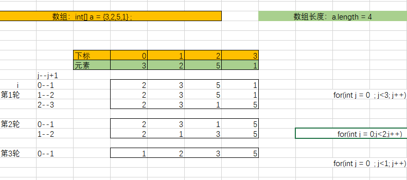

```java
规则：相邻的两个元素进行对比，如果前者大于后者则两者交换位置
第一轮会得出最大的元素
代码：
public class Demo{
public static void main(String[] args) {
//定义一个数组 a
int[] a = {3,2,5,1,4,67,89,23,45,59} ;
//  1 2 3 5
for (int i = 1;i<=a.length-1;i++) {
for (int j = 0;j<a.length-i;j++) {
if (a[j]>a[j+1]) {
int t = a[j];
a[j] = a[j+1];
a[j+1] = t;
}
}
}
//遍历数组
for (int i = 0;i<a.length;i++) {
System.out.println(a[i]);
}
}
}
```

#### 选择排序

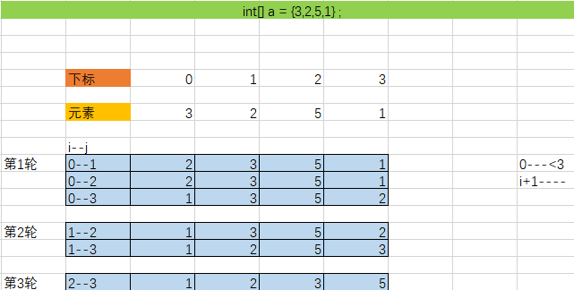

```java
规则：数组中每个元素，分别和其之后的元素进行对比，如果此元素大于后者那么两者交换位置
代码：
public class Demo{
public static void main(String[] args) {
//定义一个数组 a
int[] a = {3,2,5,1,45,67,23,42,54,78,867} ;
//  1 2 3 5
	for (int i = 0;i<a.length-1;i++) {
	for (int j = i+1;j<a.length;j++) {
		if (a[i]>a[j]) {
			int t = a[i];
			a[i] = a[j];
			a[j] = t;
		}
	}
}
//遍历数组
		for (int i = 0;i<a.length;i++) {
			System.out.print(a[i]+" ");
		}
	}
}
```

#### 快速排序

```java
Arrays.sort(要排序的数组)；
代码：
import java.util.*;
public class Demo{
public static void main(String[] args) {
//定义一个数组 a
	int[] a = {3,2,5,1,45,67,23,42,54,78};
	Arrays.sort(a);
//遍历数组
	for (int i = 0;i<a.length;i++) {
		System.out.print(a[i]+" ");
		}
	}
}
```

#### 操作数组的工具类：Arrays

```java
java.util.Arrays类包含了用来操作数组（比如排序和搜索）的各种方法。Arrays拥有一组static方法。
equals()：比较两个array是否相等。array拥有相同元素个数，且所有对应元素两两相等。
fill()：将值填入array中。 
sort()：用来对array进行排序。 
binarySearch()：在排好序的array中寻找元素。 
另：System.arraycopy()：array的复制。
```

### 二维数组

```
概念：在一维数组中的每一个元素都是一个一维数组
8中基本数据类型 引用数据类型
```

#### 定义二维数组

```java
语法：
数据类型[][] 数组名 ；//数组声明
数组名 = new 数据类型[数组长度][数组的长度];
二维数组的定义方式：
	1.声明  开辟空间
		1）声明  再开辟空间
		int[][] a; a = new int[3][4]；
		2)声明并开辟空间
		int[][] a = new int[3][4];
	2.声明 为元素赋值
		1)声明 再赋值
		int[][] a;  a = new int[][]				{{1,2,3},{4,5,6},{7,8,9}}
		2)声明并赋值
		int[][] a = new int[][]{{1,2,3},{4,5,6},{7,8,9}};
		简写：int[][] a = {{1,2,3},{4,5,6},{7,8,9}};
		注意：简写声明和赋值必须在同一句
案例：
//定义一个二维数组
int[][] a ;//声明
//变形a = {new int[4] ,new int[4] ,new int[4] }
a = new int[3][4];

赋值
语法：
a[0][0] = 1;
a[0][1] = 2;
a[0][2] = 3;
a[0][3] = 4;
a[1][0] = 3;

遍历
案例：
import java.util.*;
public class Demo{
	public static void main(String[] args) {
//定义一个二维数组
	int[][] a ;//声明
//变形a = {new int[4] ,new int[4] ,new int[4] }
	a = new int[3][4];
	a[0][0] = 1;
	a[0][1] = 2;
	a[0][2] = 3;
	a[0][3] = 4;
	a[1][0] = 3;
	for (int i = 0;i<a.length;i++) {
		for (int j = 0;j<a[i].length;j++) {
		System.out.print(a[i][j]);
}
		System.out.println();
		}
	}
}
```

#### 不规则二维数组

```java
形式：
int[][] a = {{1,2},{4,5,6},{7,8,9,4}};
案例：
import java.util.*;
public class Demo{
	public static void main(String[] args) {
int[][] a = new int[3][];
// a = {new int[4] ,new int[5] , a[2] = new int[9]}
	a[0] = new int[4];
	a[1] = new int[5];
	a[2] = new int[9];
	for (int i = 0;i<a.length;i++) {
		for (int j = 0;j<a[i].length;j++) {
			System.out.print(a[i][j]);
}
			System.out.println();
		}
	}
}

注意：
int[][] a = new int[][3];//错误的
在定义二维数组的时候，必须先定义高维数组
int[][] a =new int[高维][低维]
```

#### 小游戏
题目(30分钟，做完请立即举手，取前5名)
	猜数字游戏
	1.游戏开始后只有十次机会，十次之后提示“你没有       机会了，再从新来过吧！”
	2.游戏被猜的数为随机的整数，整数范围为0--		100; 
		提示：随机数的表示Math.random()，范围为		0到1不包括1的一个小数;
	3.当猜中时提示“恭喜你猜中了”同时退出程序，
	  当猜错时提示”你猜错了 你还有几次机会“；
	4.在游戏开始时提示”请输入0--100之间的整数
	  如果输入小数提示“输入有误”
```java
	  import java.util.*;
class MyClass1020
{
	public static void main(String[] args) 
	{
		boolean f = false;
		   
	 	int a = (int)((Math.random())*100);
	 	System.out.println("正确答案是"+a);
		for(int i=1;i<=10;i++){		
		Scanner s= new Scanner(System.in);
		
	 	System.out.println("请输入0--100之间的整数");
	 	double n =s.nextDouble();
	 	if((n-(int)n)!=0){
      		 System.out.println("输入有误，你输入的是小数");
  		 }else{
	  		
			if(n==a){
				System.out.println("恭喜你猜中了");
				f = true;
				break;
				
				
			}else{
				System.out.println("你猜错了 你还有"+(10-i)+"次机会");
				f=false;
				continue;
				}
			}
		}
		if(f==false)
		{
			System.out.println("没有机会了 重新来过吧");
		}
    }
}
```

## 面向对象

### 面向对象

```java
面向过程：从计算机执行角度出发，为代码执行为核心
面向对象：从人的角度出发，从现实角度出发
需求来自现实世界

汽车   is   a   车   （继承关系）
司机   use  a   车   （依赖关系）司机调用车的跑方法
人     has  a   财富 （关联关系）
每个对象都有方法，才有价值，才能让其他对象调用，生活中对象的抽象
面向对象：先确定解决问题所需的对象，再建立对象间关系，从而确定过程

Java 中的对象;数据 代表了生活中的一个对象

1.一切客观存在的事物都是对象 万物皆对象    
对象一定具有自己的特征（属性）和行为（方法）    
```

### 类

```java
类是对象的模板，统称，对客观对象的一种认识；    
在一组或者类似的对象中，抽取出共性的特征和行为，保留所关注的部分。 
现实生活中的类：是对对象共性的抽象 代表了一类事物 人对一类事物的认识
Java中的类：代码 定义了一类对象应该具有哪些属性和方法  ,是创建对象的模板
3.类的组成
1）属性（代表对象都有什么，由什么组成）    
2）方法：(代表对象能做什么)  
    Field=属性=成员变量
    Method=(成员)方法=函数
定义类其实是定义类中的成员（成员变量和成员方法
） 
类的语法格式
修饰符 class 类名{
		属性声明；
		方法声明；
}
说明：修饰符public： 类可以被任意访问
	类的正文要用{括起来}

创建Java自定义类步骤
1.定义类（考虑修饰符，类名）
2.编写类的属性（考虑修饰符，属性类型，属性名，初始化值）
3.编写类的方法（考虑修饰符，返回值类型，方法名，形参等）
```

### 类的成员之一：属性

```
类的成员之一：属性
语法：
	修饰符 类型 属性名=初值；
	private int age=18；
说明：修饰符private:该属性只能由该类的方法访问
	 修饰符public：该属性可以被该类以外的方法访问
	 类型：任何基本类型，如int,boolean或任何类
注意：
在方法体外，类体内声明的变量称为成员变量。
在方法体内部声明的变量称为局部变量。
二者在初始化值方面的异同:
         同：都有生命周期      
         异：局部变量除形参外，需显式初始化。
```

### 成员变量（属性）和局部变量区别


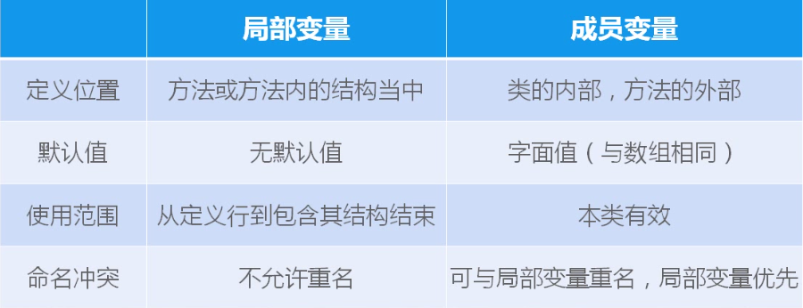
成员变量（实例变量）|局部变量
|---|---|
默认值|先赋值
全类内部|声明开始--代码块结束
可以和局部变量重名，局部变量有先|重合范围不允许两个局部变量重名

``` java
class ClassA{
		public void method(int value){
			 System.out.println(value);
}
		public void method(){
			 System.out.println(value);
}
			int value;成员
}

class TestClassA{
public static void main(String args[]){
	 ClassA classA = new ClassA();
 	 classA.value = 10;局部
     classA.method();
     classA.method(20);
  }
}
```

第一个method函数打印的是它外面的value，因为他里面没value，只有外面的value离他近
第二个method函数打印的是它的参数value，因为它的参数value比函数外面的那个value离得更近
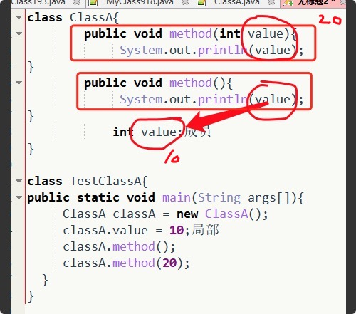


成员变量
1.成员变量定义在类中，在整个类中都可以被访问
2.成员变量 分为类成员变量和实例成员变量，实例变量存在于对象所在的堆内存中
3.成员变量有默认初始化值
4.成员变量的权限修饰符可以根据需要，选择任意一个
  
局部变量
1.局部变量只定义在局部范围内，如：方法内，代码块内等
2.局部变量存在于栈内存中
3.作用的范围结束，变量空间会自动释放
4.局部变量没有默认初始化值，每次必须显示初始化
5.局部变量声明时不能指定权限修饰符


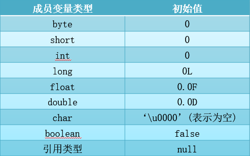

### 静态变量和实例变量的区别


```java
class  Student{
	String name;
	int age;
	static double score;
}
```
加上 static之后  score不再是实例变量 但仍是成员变量  成员变量是个大概念，尽管它不是最精确的那个说法，秉承实际开发的习惯，我们叫他成员变量。

静态变量可以直接用类名来引用。实例变量必须通过创建对象才可以使用
所以加了static之后  score就不是实例变量了  但可以说是成员变量 因为成员的概念更宽泛
```java
在语法定义上的区别：静态变量前要加static关键字，而实例变量前不加。

在程序运行时的区别：实例变量属于某个对象的属性，必须创建了实例对象，其中的实例变量才会被分配空间，才能使用这个实例变量。

静态变量不属于某个实例对象，而是属于类，所以也称为类变量，只要程序加载了类的字节码文件，不用创建任何实例象，静态变量就会被分配空间，静态变量就可以被使用了。

总之，实例变量必须创建对象后才可以通过这个对象来使用，静态变量则可以直接使用类名来引用。
```

```java
是否可以从一个static方法内部发出对非static方法的调用？

    不可以。因为非static方法要与对象关联在一起，必须创建一个对象后，才可以在该对象上进行方法的调用，而static方法调用时不需要创建对象，可以直接调用。也就是说，一个static方法被调用时，可能还没有创建任何实例对象，所以，一个static方法内部不可以发出对非static方法的调用。
```

### 类的成员之二：方法


方法是类或对象行为特征的抽象，也称函数
java里的方法不能独立存在，所有的方法必须定义在类里

语法：
访问修饰符 返回值类型 方法名（参数类型 形式参数1，参数类型 形式参数2...）{
		方法体语句（实现）；
		`return` 返回值；
}
声明代表了对象能做什么
实现代表了对象怎么做

`public int getAge(){return age;}`
其中：
形式参数：在方法调用时用于接收外部传入的数据的变量
参数类型：就是该形式参数的数据类型
返回值：方法在执行完毕后返还给调用它的程序的数据
返回值类型：方法要返回的结果的数据类型
实参：调用方法时实际传给函数形式参数的数据
说明：修饰符：`public，private,protected`等
返回值类型：`return`语句传递返回值。没有返回值：void
如果该函数的`return`语句如果在最后一行可以省略不写

方法的调用：   
定义方法时，方法的结果应该返回给调用者，交由调用者处理
方法中只能调用方法，不可以在方法内部定义方法

### 对象的创建和使用

1.对象的构建过程
分配空间|属性被赋予默认值
 |---|---|
 构造父类对象||
初始化（本类）属性|属性被赋予初始值
jvm调用（本类）构造方法 |属性可以被赋予构造方法的参数
如果在一个类中，没有定义任何构造方法，系统会提供默认的无参的公开的构造方法

A---B---C
1.分配空间1
2.初始化B属性4
	1）初始化A属性2
	2）调用A属性的构造3
3.调用B属性的构造方法5
4.初始化C属性6
5.调用C构造方法7


----------


2.对象的创建和使用

创建对象的语法：类名 变量名 =`new`类名（构建参数列表）
访问对象的语法：变量名.属性
								变量名.方法（实参列表）

使用new+构造器创建一个新的对象
用“对象名.对象成员”的方式访问对象成员（包括属性和方法）
如果创建了一个类的多个对象，对于类中定义的属性，每个对象都拥有各自的一套副本，且互不干扰
当一个对象被创建时，会对其中各种类型的成员变量自动进行初始化赋值，除了基本数据类型之外的变量类型都是引用类型，如Person以及数组


----------


类名 变量名 = new 类名();    
例如   Dog  d = new Dog();        
访问对象的属性和方法    
变量名.属性   例如     d.name;            
变量名.方法()  例如    d.eat();   


----------


注意：
1.在一个类中的访问机制：类中的方法可以直接访问类中的成员变量.(例外：static方法访问非static，编译不通过)
2.在不同类中的访问机制：先创建要访问类的对象，再用对象访问类中定义的成员
   


----------


 
补充：匿名对象
我们也可以不定义对象的句柄，而直接调用这个对象的方法。这样的对象叫做匿名对象。
如：new Person().shout(); 
使用情况
如果对一个对象只需要进行一次方法调用，那么就可以使用匿名对象。 
我们经常将匿名对象作为实参传递给一个方法调用。 


### 方法的重载


在同一个类中，允许多个同名方法
编译器在编译时会根据实参的类型，选择相应的方法去调用（向上就近原则，不允许出现引用不明确现象）
当一个类中，定义的方法的参数可能会出现比其他方法参数类型大的情况，那么这时就会遵循就近匹配原则，当所传实际参数没有没有在类中匹配的方法，那么会自动匹配比所传实际类型大的方法


----------


重载的特点：
1.方法名称相同
2.与返回值类型无关，修饰符无关，
3.只看参数列表，且参数列表必须不同（参数个数或参数类型或顺序， 不允许两个方法的参数表形参的名字不同），调用时，根据方法参数列表的不同来区别
4.public  返回值类型   方法名(形参列表){ }      
作用：允许类中的同类方法同名 ，屏蔽参数差异，使用方式更加方便，灵活。（参数不同，同一行为的行为方式会有不同）


### 可变个数的形参

```java
//下面采用数组形参来定义方法
public static void test(int a ,String[] books);
//以可变个数形参来定义方法
public static void test(int a ,String…books);

说明：
1.可变参数：方法参数部分指定类型的参数个数是可变多个
2.声明方式：方法名（参数的类型名...参数名）
3.可变参数方法的使用与方法参数部分使用数组是一致的
4.方法的参数部分有可变形参，需要放在形参声明的最后

案例：
public void test(String[] msg){
	System.out.println(“含字符串数组参数的test方法 ");
}
public void test1(String book){
	System.out.println(“****与可变形参方法构成重载的test1方法****");
}	
public void test1(String ... books){
	System.out.println("****形参长度可变的test1方法****");
}
public static void main(String[] args){
	TestOverload to = new TestOverload();
	//下面两次调用将执行第二个test方法
	to.test1();
	to.test1("aa" , "bb");
	//下面将执行第一个test方法
	to.test(new String[]{"aa"});
```

### 方法的参数传递

```java
方法，必须有其所在类或对象调用才有意义，若方法含有参数：
	形参：方法声明时的参数
	实参：方法调用时用实际传给形参的参数值
java的实参值如何传入方法
	java里方法的参数传递方式只有一种;值传递。即将实际参数值的副本（复制品）传入方法内，而参数本身不受影响
```

### 方法的构造方法


1.构造方法的方法名与类名必须完全相同（包括大小写）    
2.不能定义返回值类型     
3.构造方法可以重载，遵循重载的规则      
4.创建对象时，自动触发构造方法的调用，不可通过  .  去手动调用。    
5.在类中，如果没有定义构造方法，则编译器默认提供无参构造方法        
6.如果手动添加了有参构造，则无参构造不在默认提供，如还需要无参必须手动添加    
7.通过关键字new创建对象时，根据传入的参数，调用对应的构造方法，完成对象的创建
8.有参构造方法可以在创建对象时，为其各个属性重新初始化赋值 


### this关键字

``` javascript
class MyClass{
	int a=10;
	int b= 20;
	public void m1(){
		int a=30;
		System.put.println(a);//30
		System.out.println(this.a);//10
	}
	public oid m2(){
		System.out.println(a);//System.out.println(this.a);
		System.out.println(b);//System.out.println(this.b);
		mi();//this.mi();
	}
}
```


this关键字
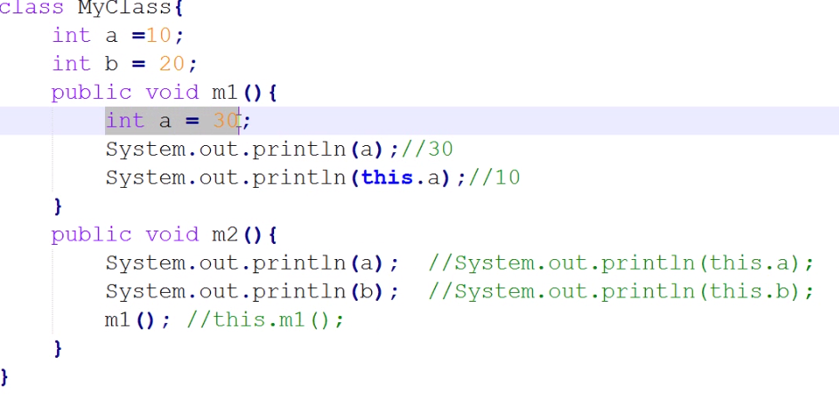

引用：对象类型的变量（除去8种基本类型的变量，都属于引用） 存储对象的地址
方法传递参数：基本类型的变量传值，对象类型的变量传地址（实参和形参指向同一对象）
1. this  

代表当前实例，当前对象，当前引用：使用this.  访问当前对象（类中）的属性和方法  ，如果不加this引用，默认为this引用，用于区分成员变量和局部变量

当实例变量与局部变量命名冲突时，默认优先使用过局部变量。如果需要访问实例变量，借助于this.        
2.   this(参数)/this()    
 代表调用本类的其他构造方法，根据括号中的参数顺序，类型以及个数去匹配构造方法（因为构造方法不能手动调用，需要用this)，**必须是构造方法的第一条语句**
3. 注意;
  一个构造方法中只能定义一个this()或者this(实际参数)
  this()和this（实际参数）只能定义在构造方法中，不能定义在成员方法中
  构造方法中this（）不能出现   ，不能自己调用自己
  ```java
  //互相调用   错误
	//无参构造方法
	public Student(){
		this(8);
		System.out.println("无参的构造被执行");
		
		//初始化代码
		/*
		10000行
		*/
	}
	//有参构造
	public Student(int age){
		this();
		this.age = age;
		
		System.out.println("一个参数的构造被执行");
	}
  ```
```java 
clsaa MyClass{
		int a = 10;
		int b = 20;
	public MyClass(){
	//10000
}
	public MyClass(int i){
		this();
	System.out.println("ok");
	}
	public MyClass(String s){
		this(10);
	}
 }	
```
```java
class CreditCard{
	String cardId;
	String password;
	double balance;
	public CreditCard(){}
	public CreditCard(String cardId,String password,double balance){
			this.cardId = cardId;
			this.password = password;
		} 
		public CreditCard(String cardId,String password,double balance){
			this(cardId,password);
			this.balance = balance;
		}
		public void method(){}
}
```
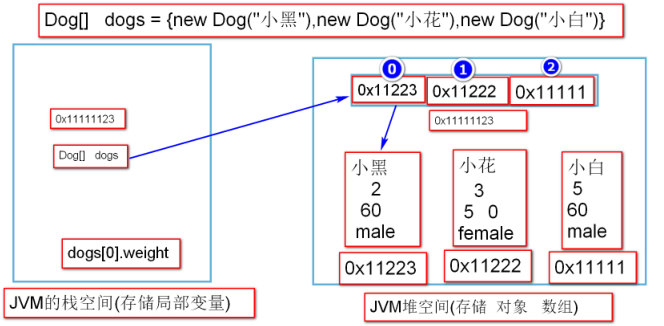
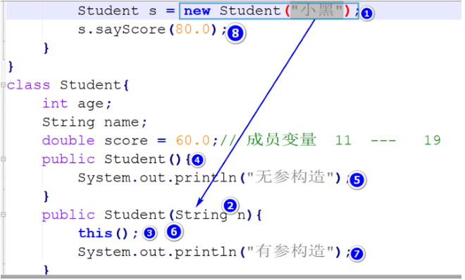

## 三大特性


###  **封装[重点]**

**1.概念**    
尽可能的隐藏对象内部的实现细节，控制用户对对象的修改和访问的权限 ，防止非法数据

**2.实现方式**    
	1).属性私有   属性被private修饰     例如  `private  int age ` 修饰的属性（成员变量）只能在本类中访问      
	2).公共方法  ` public`   修饰对应的  `get   set`方法        
	例如   `public  void setAge(int age){}`
           
**3.封装步骤**
	1.私有化属性
	2.对外提供对应属性的公开的`set()  get()`方法
	3.封装前     s.age
	4.封装后     s.setAge(20)    s.getAge();      
语法：
``` java
//set 设置属性的值
public  void setAge(int age){            
		this.age = age;                        
}            
//get 获取属性的值
public int getAge(){                    
		return this.age;                        
} 
```
```java

//案例：
public class Demo{
	public static void main(String[] args) {
		Student s = new Student();
		
		s.setAge(18);
		
	}
}

class Student{
	private String name;
	private int age;//成员变量
	
	//无参构造方法
	public Student(){
		System.out.println("无参的构造被执行");
	}
	//有参构造
	public Student(String name,int age){
		this.name = name;
		this.age = age;
		System.out.println("一个参数的构造被执行");
	}

	//set 设置属性的值  
	public void setAge(int age){
		this.age = age;
	}
	//get 获取属性的值
	

}


----------


//案例：
public class Demo{
	public static void main(String[] args) {
		Student s = new Student();
		s.setName("屎壳郎");
		s.setAge(188);
		System.out.println(s.getName());
		System.out.println(s.getAge());
		
		
		
	}
}

class Student{
	private String name;
	private int age;//成员变量
	
	//无参构造方法
	public Student(){
		//System.out.println("无参的构造被执行");
	}
	//有参构造
	public Student(String name,int age){
		this.name = name;
		this.age = age;
		System.out.println("一个参数的构造被执行");
	}

	//setAge 设置属性的值  
	public void setAge(int age){
		if (age>0&&age<=120) {
			this.age = age;
		}else{
			System.out.println("非法数据，赋值失败");
			return;
		}
		
		
	}
	//setName 设置姓名
	public void setName(String name){
		this.name = name;
		
	}
	//get 获取属性的值
	public String getName(){
		return this.name;
	}

	public int getAge(){
		if (this.age==0) {
			return -1;
		} else {
			return this.age;
		}
		
		
	}

}
```


### **继承**
类    称为  父类   超类   基类    
特殊性的类    称为   子类  派生类    
语法关键字：  子类   extends   父类    
思想：  类和类的共性  提取出来  定在在父类中  
单继承：一个类只能有一个直接父类 类之间才能形成简单的树状结构
特点：  一个父类可以有多个子类，但是一个子类只能有一个直接父类    
单继承,多级继承            
根据需求，子类还可以增加自己的功能（可扩展性）            
思考：  子类是否可以使用父类所有的方法和属性？ 

|访问修饰符|访问范围|继承性|    |
 |---|---|---|---|
 |private|本类内部|不可继承|私有的|
 |（default）|本类+同包|同包子类可继承|默认的|
 |protected|本类+同包+子类|可继承|受保护的|
 public|公开|可以继承|公开的|
 >构造方法不可继承
 >组合/聚合复用原则 对于违反里氏代换原则的两个类，由于不存在 is a 关系，所以不能定义继承 可以用组合的方式实现类的代码复用
>注意：  以上四种访问修饰符，都可以修饰  属性/方法/构造方法   

### 方法覆盖Override：
子类用特殊的方法实现，替换掉父类继承给它的方法实现
语法：方法名相同，参数表相同，返回值类型相同，访问修饰符相同或更宽
从IDK5.0开始，子类方法的返回值类型 可以是父类方法返回值类型的子类

### super
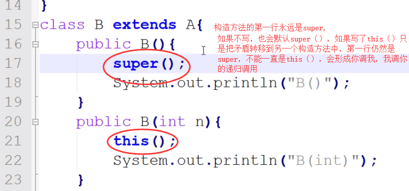
super()用在构造方法中 ，指明调用父类哪个构造方法，必须出现在构造方法的第一行
如果一个构造方法的第一行不是super(...),也不是this(...) 默认代码为 super();

super :引用 指向父类对象
			用于访问父类被遮盖的属性
			用于调用父类被遮盖的方法
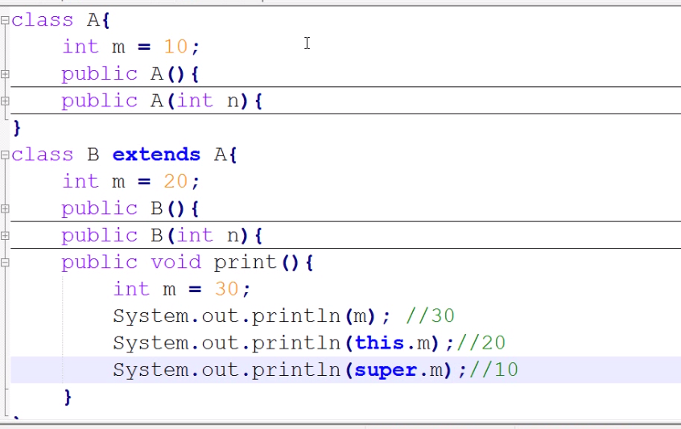
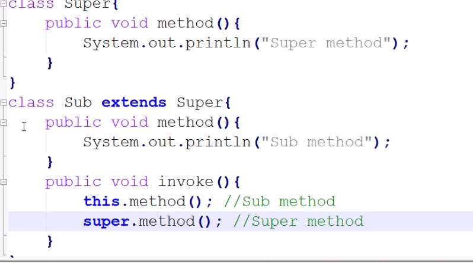

### **多态**
子类对象可以赋值给父类引用
1）只能对引用调用其引用类型中声明的方法
2）运行时，根据对象实现类型，调用子类覆盖之后的方法
3）对象类型不变 强制类型转换 用于父类引用赋值给子类引用 无法改变对象类型

概念： 父类类型的引用  指向子类的对象，称之为多态
例如   Animal    a =    new Dog();                
父类类型          子类的对象
主观认为           实际类型                    
使用：1.  子类的实际类型不会发生变化        
            2.  编译时，只能使用父类中所拥有的方法（能被继承使用的）        
            3.  运行时，子类中覆盖的方法会被优先执行，如果调用的是没有覆盖的方法，则继承父类中的方法            
 引用类型之间的相互转换
目标类型  和  源类型 必须兼容（存在继承关系）            
1.自动类型转换（向上转型  装箱）            
 例如  Animal  a = new Dog();            
2.强制类型转换（向下转型  拆箱）            
 例如   Dog  d = (Dog)a;   
 
引用 `insanceof`类名  “判断引用中的对象 是不是 类名”  用作在强制类型转换之前进行类型判断，避免类型转换异常        
语法：   引用名  instanceof  类型   《===》  布尔值            
例如：   Animal  a = new Dog();   a  instanceof  Dog            
                                      是不是            
多态的应用场景 
多态的作用：把不同子类的对象，统一看做是父类对象来处理，屏蔽了不同子类的差异 通用性
1.多态应用在方法的形参上       m(A a)：m方法允许A类或A的某个子类对象作为实参    
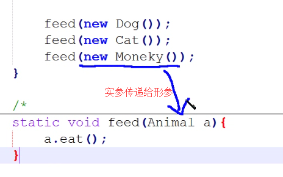 
2.多态应用在方法的返回值类型上 A m():m方法返回的是A类或A的某个子类对象
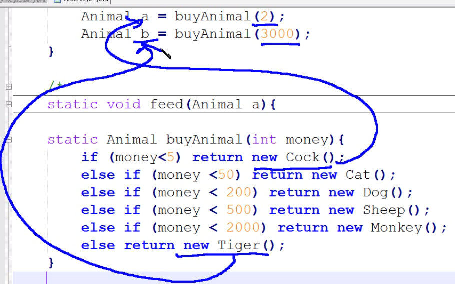

>注意：把返回值类型设置成父类更加通用 可以返回父类以及子类
形参里面定义为父类 就可以传父类以及子类作为实参 

## 三大修饰符[ abstract static final]

### 1.abstract


修饰类：  类成为抽象类，可以声明引用，不能实例化对象[不能  new  对象]
修饰方法： 只能有方法的声明，没有方法的实现
注意：
如果一个类拥有抽象方法，这个类必须是抽象类 抽象类未必有抽象方法
子类继承一个抽象类，如果子类不希望也成为抽象类，就必须实现父类中所有的抽象方法
子类继承抽象类之后，必须覆盖父类中所有的抽象方法，否则子类也是抽象类

>注意：
>1.这个修饰符修饰方法时，不包括构造方法，构造方法不可能是抽象方法，因为构造方法不能继承给子类，更谈不上覆盖，抽象是在父类中声明，在子类中实现，所以如果构造方法抽象了，就不能实现了。
2.私有方法也不能是抽象方法，私有方法不可继承，就无法覆盖，无法实现

### 2.static[静态]


1.概念    
static修饰的成员称为类成员[静态成员]，全类共享，不属于某一个具体的对象  可直接通过类名进行访问   

2.静态方法中只能访问类的静态成员（成员二字包含了属性也包含了方法），不能访问类的非静态成员和方法，不能出现this

初始代码块：静态初始代码块在类加载的时候执行
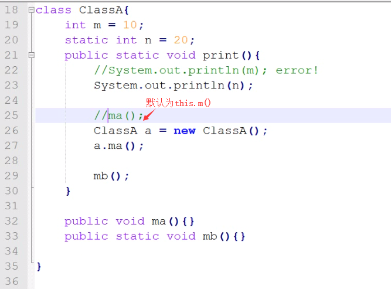
3.静态属性(类属性)，静态方法(类方法)    
  访问方式： 类名.静态属性名   
  					   类名.静态方法名()    
  注意：所有通过引用访问静态属性的方式，都会自动提升为类名访问    
  
例如     mc1.b   ‐‐‐‐   MyClass.b            
静态方法，也是基于类去访问。    
成员变量时每个都有一份
静态变量时整个类只有这一个
局部变量不能静态，属性可以

4.静态方法可以被继承,没有多态：父类引用执行父类的静态方法，子类引用执行子类的静态方法

  5.静态方法只能被子类的静态方法覆盖，而且没有多态（只根据引用类型调用相应的静态方法
   跟引用里装的对象是什么类型没有任何关系）

5.动态代码块    
   {        
   //功能性代码   一般用于给常量[普通成员变量]赋值，进行必要的初始化操作            
   }        
   静态代码块        
   static{            
   //功能性代码   一般用于给静态属性[静态成员变量]赋值，进行必要的初始化操作                
   }            

### 类加载    
   1.JVM首次使用(创建对象，调用静态成员，使用子类时Class.forName("类的全限定名"))到某个类，需要通过CLASSPATH查找该类的.class
   
   2.类加载，会将类中所有的描述信息（类名，包名，方法，属性，构造方法...）读取到内存中
   
   3.类加载的时机：
   1）创建对象 
   2）加载子类，需要先加载父类 
   3）访问静态成员
   4）Class.forName("类名")
  如果只是声明一个类的引用，不需要类加载

   4.类加载的步骤：
    1）如果需要的话，要先加载父类
    2）按照顺序初始化静态属性，或执行静态初始化代码块

   7.对象的构建过程[不存在继承]    
   1.分配空间    
   2.加载静态成员[静态属性 静态代码块   静态方法]   ‐‐‐   只执行一次    
   3.初始化普通属性    
   4.调用构造方法    ‐‐‐‐‐   对象构建结束    
   
   8.存在继承关系对象的构建过程    
   1.加载父类的静态成员            
   父类静态属性的初始化                
   父类静态代码块的执行                
  54646464646	                   2.加载子类的静态成员            
   子类的静态属性的初始化                
   子类静态代码块的执行                
   ‐‐‐‐‐  父子类静态成员的加载只执行一次                                
   3.初始化父类的普通属性            
   4.父类动态代码块的执行            
   5.调用父类的构造方法‐‐‐‐‐父类对象构建结束            
   6.初始化子类属性            
   7.子类动态代码块的执行            
   8.调用子类的构造方法‐‐‐‐‐子类对象构建结束            
   若构建多个子类对象   循环执行 345678     


###  3.final


1.修饰类 ：此类不能被继承：类中所有的内容不可做修改    
例如   String   System   Math            
2.修饰方法： 此方法不能被覆盖
2.修饰属性： 修饰属性的时候，该属性就没有默认值，就必须手动赋值   
3.修饰变量： 此变量值不可被改变    变成常量    
局部常量：显示初始化            
实例常量：没有默认值  只有一次赋值：声明时赋值
静态常量：static  final  int  a;            
没有默认值   只有一次赋值机会：   声明时赋值  ，静态代码块赋值           4.基本数据类型‐‐‐‐‐被final修饰之后。值不允许改变        
   引用数据类型‐‐‐‐‐被final修饰之后，地址不允许改变
  
private protected可以修饰 属性方法 构造方法
default public 除了修饰属性方法构造方法，还能修饰类

private abstract 不能联用
final abstrct 不能调用
static abstract 不能联用                

## 接口

### 1.概念


特殊的抽象类
1.属性都是公开静态常量	public static final
2.方法都是公开抽象方法	public abstract void	
3.没有构造方法
4.接口，是一种标准/规范/约束  接口往往有接口的使用者，还有接口的实现者。两者都必须遵循接口的约束。

### 2.接口与抽象之间的异同点


相同点：
编译之后都会生成字节码文件
不能实例化对象，可以声明引用，并且使用多态
不同点
1.接口中没有构造方法
2.接口中的属性一定是公开静态常量  public static final
3.接口中的方法一定都是公开抽象的方法  public  abstract
4.接口中不可定义代码块（静态代码块 动态代码块）

### 3.接口使用的语法


定义语法： interface 接口名{属性  普通方法}
实现语法： 实现类 implements 接口名{
        //覆盖实现接口中声明的所有公开抽象方法
}
class ClassA extends ClassB implements IA,IB,IC.....{}
接口与接口之间的关系
 interface 子接口 extends 父接口1，父接口2，父接口3....{}
 
 一个类实现接口，如果这个类不希望成为抽象类，就必须实现接口中所有抽象方法
接口之间可以定义多继承关系
一个类在继承另外一个类的同时，还能实现多个接口

子类引用可以直接赋值给父类引用
父类引用需要强转才能赋值给子类引用
没有继承关系的两种类型之间不能强转赋值

墙砖的两种类型中，如果包含接口类型，强转代码一定编译通过


注意： 继承的类，称之为直接父类，实现的接口，称之为间接父类。
一个类可以实现多个接口
引用类型强转时，无论是否继承或者实现了某个接口，强转编译都OK, 但是运行时，可能会出现类型转化异常

```java
package day1;
public class TestInterface{
public static void main(String[] args){
ClassA ca = new MyClass(); //  多态
IA  ia = new MyClass();  // 多态
MyClass mc = (MyClass)ca;  //  类与类之间  存在extends  加上强转之后 编译通过
MyClassA ma = (MyClassA)ia;
}
}
/*
  A ---  B
免费转账

4.接口的好处
二.内部类
1.概念： 定义在类内部的类
2.成员内部类
   A  账户  扣 五千
 B  账户  加 五千
  有偿转账
     A  账户  扣  五千
       1.手续费扣除
     B 账户  加  五千
       2.手续费扣除 
*/
class MyClassA{
}
abstract class ClassA{
public abstract void m1();
}
interface IC{
void m4();
}
interface ID{
void m6();
}
interface IA extends IC,ID{  //  IA ia  ia.
void m2();
void m3();
}
interface IB extends IC{
void m5();
}
class MyClass extends ClassA implements IA,IB{
public void m1(){
System.out.println("m1()....");
}
public void m2(){}
public void m3(){}
public void m4(){}
public void m5(){}
public void m6(){}
}
```

###  4.接口的好处


1.把主要功能（父类）和次要功能（接口）加以区分。使用实现过程相对简单，为功能的拓展和功能的多样化提供了可
能。有了接口之后，弥补了类与类之间的单继承关系。


## 内部类[重点]

#### 1.概念


1.定义在类中完整的一个类

```java 
外部类
class Outer {
内部类
	class Inner{
	}
}
```
2.编译之后，内部类会生成对应的独立的.class文件。文件名：外部类类名$内部类类名.class
3.内部类可以直接访问外部类的私有属性，从而不破坏外部类的封装性。

### 2.成员内部类

类比于实例变量
1.定义位置： 等同于成员变量  类以内  方法以外
语法：
```java
  class Outer{
    int age;
    String name;
    class Inner{
      // 成员内部类
    }  
  }
  ```
 

2.创建一个成员内部类的对象，必须先创建外部类的对象，再使用外部类对象的引用.new的语法
```java
     //  先创建外部类的对象
     Outer outer = new Outer();
     //  基于外部类的引用来构建成员内部类的对象
     Outer.Inner  i =  outer.new Inner();
```
3.成员内部类可以直接访问外部类的私有属性或是成员方法

4.外部类.this  :  指向外部类的当前对象
外部类.this.属性名  ：访问外部类的属性
外部类.this.成员方法名（实参）；访问外部类的成员方法
this.属性名 代表内部类的某个属性 

5.成员内部类中  不可定义静态成员(静态属性  静态方法  静态代码块)


```java
//示例代码：
package day2;
public class TestInnerClass1{
public static void main(String[] args){
Outer outer = new Outer();  // 构建外部类的对象
Outer.Inner inner = outer.new Inner();
inner.m1();
	}
}
class Outer{
private String name = "外部类的属性";   //  9  -- 16
class Inner{
static int age = 10;
String name = "内部类的属性";
public void m1(){
System.out.println(this.name);//内部类的属性
System.out.println(Outer.this.name);//外部类的属性
		}
	}
}
```

### 3.静态内部类


定义位置：  等同于静态属性|类变量   类以内 方法以外  被 static  修饰
```java
//语法：
  class Outer{
    static class Inner{
      
    }
  }
  ```
注意：
1.静态内部类，只能直接访问外部类的静态成员（静态方法和静态属性）
2.创建静态内部类的对象，不需要依赖于外部类的对象,依赖外部类的类名
    `Outer.Inner  inner = new Outer.Inner();`
3.静态内部类中可以定义静态成员 也可以定义实例成员
访问的语法  外部类类名.内部类类名.静态成员

```java
package day2;
public class TestInnerClass1{
public static void main(String[] args){
Outer.Inner inner = new Outer.Inner();
inner.m1();
Outer.Inner.m2();
}
}
class Outer{
static String name="外部类的静态属性";
static String sex = "外部类的静态属性"
static class Inner{
String name = "静态内部类的普通属性";
public static void m2(){
System.out.println(sex);
}
public void m1(){
System.out.println(Outer.name);
		}
	}
}
```

### 4.局部内部类（了解）

```java
定义位置：  等同于局部变量  在方法内
语法：
class  Outer{
public void m1(){
int a = 0;
 class Inner{
 //局部内部类
 }
}
}  
```
位置是在方法内部
创建局部内部类的对象必须在局部内部类所定义的方法内部创建，同时创建对象的语句必须在类定义的后面
注意：  
1.局部内部类中不可以定义静态成员
2.局部内部类生成的.class文件中包含数字  其他与成员内部类一致
3.局部内部类等同于局部变量
4.this.属性名代表内部类的某个属性   外部类类名.this.属性名 代表外部类的某个成员属性
5.局部内部类中依然可以访问外部类的私有成员
6.局部内部类如果想要访问外部类的局部变量(同一个方法内)，那么该局部变量必须是被final修饰。但是JDK1.8之后  编译器会在给这个局部内部类中使用的外部类的局部变量自动添加上final  这种操作成为语法糖[面试笔试题]


### 5匿名内部类

特殊的局部内部类
特殊性：必须继承一个类或是实现一个接口
基于一个匿名内部类只能创建该类的一个对象，而且对象的创建和类的定义一起完成
 语法：
   注意：匿名内部类实现接口的形式：必须实现接口中所有方法
 ```java
   			实现接口：
   				interface IA{
					void method()；
   				}

   				main函数中匿名内部类：
   					IA ia=new IA(){
							public void method(){
								//方法的实现部分
							}  					
   						};
   		          
					
----------------------------------------------------------
   		    继承类：
   		    	class MyClass{
	   		    	public void test(){}
   		    	}

   		    	main函数中匿名内部类：
   		    		MyClass mc= new MyClass(){}; 
   		    	
```
注意：匿名内部类继承类的形式：可以不覆盖类中的已有方法。
   		 匿名内部类的优缺点
   			优点：简化代码，同时可以使程序不间断编程思路。
   			缺点：可读性差。 
			
语法：
new 父类名/接口名(){
//类的内容
}
不但定义了类  还同时创建了对象
```java 
package com.baizhi.inner;
import java.util.Scanner;
public class TestInnerClass2 {
		public static void main(String[] args) {
//  学生选课系统
				School s = new School();
				s.getTeacher(5);
	}
}
class School{
	public void getTeacher(int a){
		if(a%2==0){
			new Teacher(){
	public void teach(){
System.out.println("Gaosc 授课");
	}
};
		}else{
//匿名内部类
		new Teacher(){
		//方法实现部分
		public void teach(){
				System.out.println("Wyx 授课");
				}
			};
		}
	}
}
//实现接口
interface Teacher{
	public void teach();
}
```

## Object

### 1.概念

1.Object类位于 java.lang 包中，是所有类的父类（直接父类或是间接父类）
2.Object类型的引用可以存储任意类型对象。
3.Object中定义的方法是每一个类都默认具有功能方法。

### 2.Object的API

#### getClass
public final Class getClass():  //返回引用中实际存储对象的类型。用于判断两个对象的运行时类型是否一致（用 ==），被final修饰不能被覆盖
```java
	Animal a1= new Dog();
	Animal a2= new Cat();
	System.out.println(a1.getClass()==a2.getClass());
```
#### hashCode

public int hashCode():// 返回对象的哈希码值，哈希码值的来源是对象十六进制的内存地址转换为十进制整数的结果。一个对象的整数名称（身份证号） 根据对象的地址或者字符串或者数字计算出来的。哈希码不是唯一的。 尽量保证不同的对象返回不同的哈希码值。

#### toString
public  String toString():// 返回对象的字符串形式
	实际开发应用：通常将自定义类中的toString方法进行覆盖，打印输出对象的属性信息
	
覆盖的原则 ：将所有属性拼接为一个String类型的结果进行返回

```java
public String toString(){
		return "name="+name+",age=";
	}
```
>注意toStrong方法和get方法的区别
	（1）get方法是获取单个属性的信息，并且不更改属性的原数据类型
	   (2)  toString方法是获取所有属性的信息，并且是以String类型结果的返回--方便程序员打印输出对象信息用的
	
#### equals
public boolean equals(Object obj):// 判断指定对象是否与此对象“相等”。。。可以判断两个对象的地址是否相同 ，相同为true ，不同为false
	(1)==的应用
		①如果==
			两端是基本数据类型的变量，则比较数值是否相同
		②如果==
			两端是引用类型的变量，则比较引用中存储的地址是否相同
						实际开发应用：通常用==判断两个引用是否指向同一个对象
						引用1 == 引用2     ---》true 代表指向同一个对象
						                                	   false 代表指向不同的对象
（2）equals方法的应用
	1.Object类中提供的equals方法默认是比较两个对象的地址是否相同
	2.自定义类型的对象利用equals比较对象内容同时需要手动覆盖，覆盖原则如下：
	
```java
	public boolean equals(Object o){
	1.自反性：判断两个引用是否指向同一个对象
		if(this==o){
			return true;
		}
	2.判断 o 是否指向空
	if（0==null）{
			return false;
		}
	3.判断两引用中存储的对象实际类型是否一致
	if（	this.getClass（）!= o.getClasss()）{
				return false;
			}
	4.强制类型转换
	Student s = (Student)o;	
	5.将两个对象的属性内容一一比较：基本数据类型==：引用类型：equals
	if（this.age==s.age &&this.name.equals(s.name)）{
				return true;
		}else{
			return false;
		}
	}
```

#### finalize

protected  void  finalize()  throws Throwable //  当对象被判定为垃圾对象时，由垃圾回收器(GC)调用该方法


void finalize()：JVM中的垃圾回收器进行回收垃圾对象，自动调用方法(面试重要，性能调优)
1.垃圾对象：  没有任何引用指向的对象   Student  stu = new Student();   stu=null;
2.垃圾回收器：简称GC，用于JVM完成回收垃圾对象
3.垃圾回收目的：  销毁垃圾对象，释放数据存储空间（释放JVM内存）
4.垃圾回收器（GC）回收垃圾对象的时机
	自动回收机制： J当JVM内存耗尽，不能再为新创建的对象分配空间时，JVM会启动垃圾回收器，将垃圾对象一次性进行回收(当垃圾回收器回收垃圾对象时，自动调用finalize方法)。
	手动回收机制： 通过 System.gc(); 通知JVM启动垃圾回收器进行垃圾回收，如果 GC处于空闲状态，则垃圾进行垃圾回收；如果GC处于繁忙状态，则暂不回收。
	
>面试题目
>：写出  final 和 finalize 的区别。
				        final  修饰符：修饰类、变量、方法
				        	    修饰的类：不允许被继承，即没有子类
				        	    修饰的方法：不能被覆盖，可以被继承
				        	    修饰变量：作用范围内的常亮，允许一次赋值
				        finalize:是方法名，垃圾回收器回收垃圾对象,JVM自动调用的方法。

## 包装类

### 1.概念

1.概念：8种基本数据类型对应的引用/对象类型，称为基本数据类型的包装类
2.基本数据类型对应 包装类：位于java.lang包中【重点】
|基本数据类型|包装类|
|---|---|
|byte|Byte|
|lshort|Short/Number|
|long|Long|
|int|Integer|
|float|Float|
|double|Double|
|boolean|Boolean|
|char|Character|

### 2.类型转化的总结

#### 1.基本数据类型转化为对应的包装类型


第一种方式：  使用参数对应的基本数据类型的构造方法
第二种方式：  调用对应包装类的静态方法  valueOf()；


#### 2.包装类型转化为对应的基本类型


使用包装类对象，并调用  xxxValue()   xxx代表对应的基本数据类型
Integer a = new Integer(10);
int b = Integer.intValue();


#### 3.String 转化为包装类型


第一种方式： 使用参数对应的基本数据类型的构造方法
第二种方式： 调用包装类中的静态方法   valueOf()
 注意：  如果该String不是一个合法的数字，则会报错
  String s = "100";
  Integer a = new Integer(s);
  Integer b = Integer.valueOf(s);


#### 4.包装类型转化为String


第一种方式：  可以使用字符串拼接来转化  
Integer a = 10;
 String s = a+"";
第二种方式：  String 中的静态方法 valueOf()
Integer a = 10;
String s = String.valueOf(a);


#### 5.基本类型转化为String类型


第一种方法：  通过字符串拼接  
  int a = 10   String  s = a+"";
第二种方式：  先转化为包装类，再转化为String


#### 6.String 转化为基本类型


第一种方式：  String先转化为包装类型，在转化为基本类型
第二种方式：  调用对应包装类中的静态方法   parseXxx（)   Xxx代表基本的数据类型
String  s = "100";
int  a = Integer.parseInt(s);


#### 7.包装类的缓冲区


jdk1.5之后  java为八种基本数据类型所对应的包装类，提供了一个字节的缓冲区。当字面值在  -128~127之间，且字面值相同时，则两个包装类对象所指向的地址相同，均为缓冲区中的地址

为了提高转换的效率，Integer中将 -128~127作为常用数据段进行预先包装处理，包装的结果存储在方法区中常量池中，也称为缓冲区
 
 **总结：数据类型之间的转换：**
	（1）int 和 Integer 之间的转换
				int --->Integer
					① Integer i1= new Ingeter(12);//借助Integer的构造方法
					②Integer i2 = Integer.valueOf(12);//借助Integer中的静态方法 valueOf
				Integer--->int
					① int a=i2.intValue();
		(2) String和Integer之间的转换
				String--->Integer
					①Integer i3 = new Interger(“123”);
					②Integer i4 = Integer.valueOf("123");
				Integer--->String
					①String s1 = i4.toString();
					②String s2 = i4+"";//利用字符串拼接
		（3）int 和String之间的转换
				int--->String
						int a=5;
					①String s3=a3+"";//注意：基本数据类型没有toString方法
				String --->int
					①int a4= Integer.parseInt("123")//借助Integer静态方法【开发应用重点】
>注意：String类型数据转换为int/Integer时，要求转换字符串必须是纯数值类型，否则运行报错，错误信息：java.lang.NumberFormatException(数值类型转换异常)

#### 装箱拆箱
①JDK5.0之后 提供自动装箱和拆箱功能 ，即基本数据类型和对应的包装类型之间可以相互转换
②
	装箱：基本数据类型 转换为 对应的包装类型的过程 Integer i=12;
	拆箱：包装类型 转化为对应 基本数据类型的过程 int a=i;
```java
int a = 10;
Integer  i = new Integer(a);
Integer  j = Integer.valueOf(a);//基本类型转化为对应的包装类型
int b = i.intValue(); // 包装类转化为对应的基本类型
```
③ 自动装箱的原理【面试重点难点】
	（1）自动装箱底层 调用是 Integer 类中valueOf方法完成转换
```java  
			public ststic Integer valueOf(int i){
			if(i>= -128 && i<=127)
						return  对应的常量池的包装结果;
					return new Integer(i);
			}
```


	
>面试题目：
			    	Integer i1 = 12;
			    	Integer i2 = 12;
			    	System.out.println(i1==i2);//true
					Integer i3 = 129;
			    	Integer i4 = 129;
			    	System.out.println(i3==i4);//false
	
#### 实际开发应用【开发重点】
（1）作用：可以区分程序中有效数据和无效数据	,例如：0和null;'
   (2)  场景：通常将类中属性由之前的基本数据类型改变为对应包装类型--->区分数据有效性
	   
## String类

### 1.String的概念


1.String表示字符串，是对char[]  的一种封装
2.字符串是常量，创建后不可更改
3.字符串字面值存储在串池中，不可更改，不会销毁。提高可重用性


###  2.获取字符串的方式：【面试题目】

（1）String str ="hello";
			在串池中产生一个对象，供其他字符串共享
（2）String str2 = new String("world");
			产生两个对象，一个在堆空间中产生，另一个在串池中产生，如果串池中已经存在此字符串，则不在串池中创建
	

```java
1. String s1 = "hello"; //只在串池中构建了一个 "hello"
String s2 = "hello" // 与s1共享串池中的 "hello"  并未新建对象
String s3 = new String("abc")//  在堆空间中构建一个对象 "abc"  在串池中构建
"abc" 一共两个对象
String  s4 = "abc"; //  未新建对象  与  s3在串池中构建的 "abc" 共享
String  s5 = s3.intern(); //  s5指向串池中  "abc" 的地址
System.out.println（s5==s4）//  true
System.out.println(s3==s4)// false
System.out.println(s3==s5)//false
```

### 3.不可变的字符串与可变字符串


1.String不可变字符串即字符串是字面值常量，一旦创建不能改变，如果对字符串进行拼接，则会在原文本的基础上拷贝一个副文本，在副文本的基础上完成字符串的拼接（原文本保持不变）
当对串池中的对象进行修改时，都是在源对象的基础上创建副本，然后在副本的基础上进行
改变，源对象并未改变
特殊点：String  s= "a"+"b"+"c";如果拼接时 +两端都是字符串常量，则在编译时直接翻译成“abc”,运行时只会产生一个对象,这种情况称为编译期可知。
2.可变字符串
1.位于 java.lang包中：
		StringBuffer: JDK1.0版本，线程安全，效率慢
		StringBuilder:JDK5.0版本，线程不安全，效率快

2.常用的方法：
		append(String str):完成字符串的拼接
		
3.可变长字符串进行字符串拼接时，相对 String的拼接效率 较高。

面试题目： 写出 String 和  StringBuilder 的区别？
		          写出 StringBuffer 和 StringBuilder 的区别？

```java
package com.baizhi.object;
public class TestString {
public static void main(String[] args) {
String  s1 = "hello";
String s2 = "hello";
s1+="world";
//System.out.println(s1==s2);
StringBuilder sb = new StringBuilder("hello");
StringBuilder sb1 = sb;
sb.append("world");
System.out.println(sb);
System.out.println(sb==sb1);
	}
}
```

### 4.String类中常用的API


详细见API


①`public char charAt(int index) ：`获取对应下标的字符内容
注意：（1）String底层本质为char类型的数组，所有String下标从0开始，长度为字符个数
			（2）如果给定下标超出String的最大下标数，则运行报错，错误信息为java.lang.StringIndexOutOfBoundsException(字符串下标越界)

②`public boolean contains(String str): `判断当前字符串中是否包含str

③`public boolean equals(Object obj): `比较字符串的内容是否相同。
注意：开发时遇到比较字符串内容时，严谨应用equals方法比较


④`public int indexOf(String str): `在当前串中查找str出现的下标，如果存在，则返回str第一个字符在str出现的下标；如果不存在，则返回-1。


⑤`public int length():`返回字符串的长度。
实际开发应用：遍历字符串。
				for(int i=0;i<str.length();i++){ //控制字符串的下标
					//根据下标获取对应的字符
					char c= str.charAt(i);
					//利用 c 操作每一个字符
				}	


⑥`public String trim():`去掉字符串前后的空格。
实际开发应用： int n = Integer.parseInt(str2.trim());	


public String[] split(String str):根据str做拆分。
public String toUpperCase():将小写转成大写。
public String toLowerCase():将大写转成小写。
public int indexOf(String str,int fromindex):同上,从指定下标开始查找。
public int lastIndexOf(String str):查找字符串在当前字符串中最后一次出现的下标索引。
public boolean endWith(String str):判断字符串是否以str结尾(用于判断文件类型)
public char[] toCharArray():将字符串转换成数组。
public String intern():当一个String类型的对象，去调用用intren（）方法方法时，会返回此对象（串池中的对象） 如果该对象在串池中不存在，则创建一个再返回

### 5. BigDecimal

1.位置：位于 java.math包中
	2. 作用：精确表示、计算浮点数	
	3. 常用的方法：
		① BigDecimal r1 = bd1.add(bd2);// 加法
		② BigDecimal r2 = bd1.subtract(bd2); //减法
		③ BigDecimal r3 = bd1.multiply(bd2);//乘法
		④ BigDecimal r4 = bd1.divide(bd2,3,BigDecimal.ROUND_HALF_UP);
			参数说明：
				第一个参数：代表分母
				第二个参数：代表保留到小数点后第几位
				第三个参数：代表取舍模式，通常采用四舍五入(BigDecimal.ROUND_HALF_UP)


```java

package com.baizhi.object;
import java.math.BigDecimal;
public class TestString {
public static void main(String[] args) {
BigDecimal bd1 = new BigDecimal("1.0"); 
BigDecimal bd2 = new BigDecimal("0.9");
// 计算  1.0  和 0.9 的差
BigDecimal subtract = bd1.subtract(bd2);
System.out.println("1.0 - 0.9 ="+subtract);
// 计算 1.0  和  0.9 的和
BigDecimal add = bd1.add(bd2);
System.out.println("1.0 + 0.9 ="+add);
// 计算 1.0 和 0.9 的乘积
BigDecimal multiply = bd1.multiply(bd2);
System.out.println("1.0 * 0.9 ="+multiply);
// 计算 1.0 和 0.9 的商  bd1.divide(除数,保留位数,取舍方式)
BigDecimal divide = bd1.divide(bd2, 3, BigDecimal.ROUND_HALF_UP);
System.out.println("1.0 除以 0.9等于"+divide);
	}
}

```

#### 6.面试题


1.String 和 StringBuilder的区别
2.StringBuffer和StringBuilder的区别
3.String有几种构建方式，区别是什么？
String str1 = "Hello";
String str2 = new String("Hello");
4.String类API

## 集合框架【重点】


### 概念
1.集合：是一种工具类，同时也是一种容器，可以存储多个对象
collection：元素的类型都是Object
list:元素是按顺序存储的（有下标），元素可以重复
set：元素无下标，元素不可以重复


### collection常用的方法

```java
add(Object o) 添加元素
addAll(Collection c) 把c集合中的元素添加到一个新的集合中
clear()清空一个集合中的所有元素
contains(Object o)判断集合中是否存在制定元素
remove(Object o)移除单个元素，前提：存在
size() 返回集合中元素的个数
toArray() 将集合转化为一个数组
```

### List中常用的方法

```
add(int index,Object o)请一个元素插入到制定位置
remove(int index) 删除制定位置上的元素
get（int index） 获得制定位置上的元素
indexOf(Object o) 返回第一次出现此元素的下标，若没有，返回值为-1
lastIndexOf(Object o) 返回最后一次出现此元素的下标，若没有，返回值为-1
set（int pos,Object o）将o元素设置到pos的位置上
```

### List的实现类

#### 1.ArrayList(重点)

```
数组结构存储
轻量级，查询速度快，增删慢
JDK1.2 操作速度快，但是线程不安全
```

### 2.Vector

```
数组结构存储
重量级，查询速度快，增删慢
JDK1.0 操作速度慢，线程安全
```

### 3.LinkedList

```
链表结构存储
查询慢，增删快
```

```java
集合两个父接口
Collection分为两个子接口
List特点：有序，有下标，元素可以重复
实现类：ArrayList数组实现  LinkedList链表实现  Vector数组实现，线程安全的
Set特点：无序，无下标，元素不可重复
Set方法  增加add(object)	remove(object) 无修改方法 长度size()  无查询方法
hashSet    先调用该对象的hashcode方法  如果hashcode码不一致，则表示不是同一对象，如果一致，会调用该对象的equals方法，如果equals方法返回false，被视为不是同一对象，否则被视为同一对象
存的是基本类型，会自动将基本类型转化为包装类，然后根据hashcode排序
linkedhashSet  链表实现  目的是为了维护添加元素的顺序  
如果添加的是自定义对象类型，一样需要重写equals方法和hashcode方法
treeSet   通过红黑树实现的  如果向该集合存入的是一个自定义的对象类型，首先需要让该类实现一个comparable接口  重写该接口的一个方法compareTo方法
compareTo方法参数是对象类型，返回值类型是int类型
当前对象的值>参数传递过来的值  那么当先对象排到参数对象的后面
当前对象的值<参数传递过来的值  那么当前对象排到参数对象的前面
当前对象的值=参数传递过来的值  这两个对象相同

Map

```


